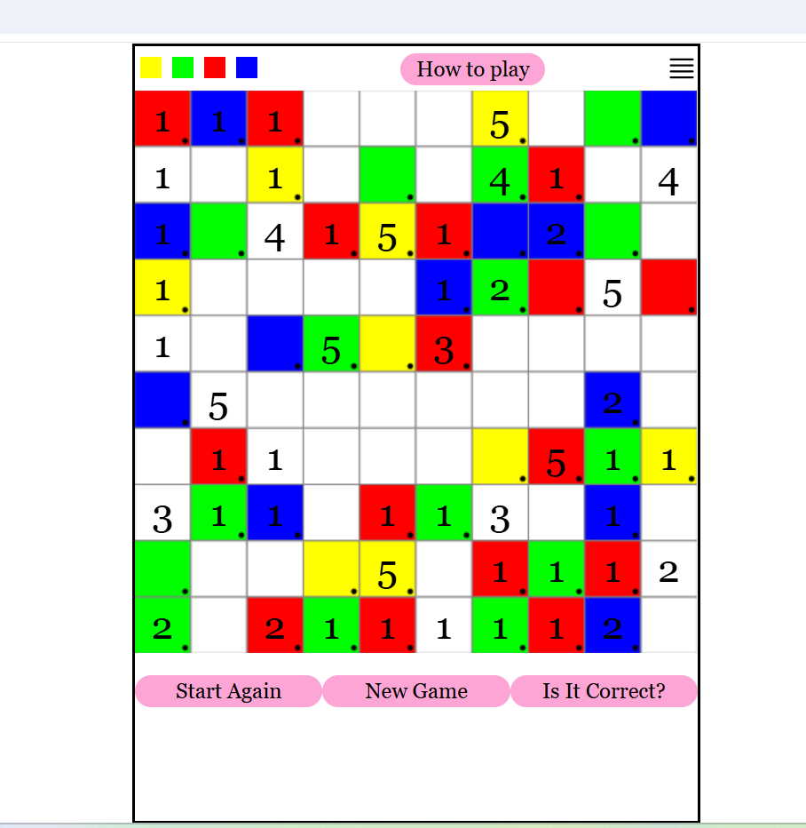

## Ran-gi

Ran-gi is a puzzle game where you use logic and elimination to determine the colour of squares within a grid.  

### Essential Code
See *src/components/Skeleton.tsx* for the React set-up, including GraphQL, reading from window.localStorage and global state providers.  

See *src/game/board.ts* for the logic powering game management.

### Creation and solution of game  
The code for the creation and solution algorithms is in *src/lib* folder in the following files:  

1. *solver.js*
2. *cluefiller.js*
3. *tile-class.js*
4. *tile.js*

### Run locally
Ran-gi is a Next.js application.  
After cloning the repository, install dependencies :  
`npm i`  
or  
`npm install`  

Then run in development mode:  
`npm run dev` 

You can optionally add a MongoDB URL to a .env file and connect to a MongoDB server in order
to store puzzles.
